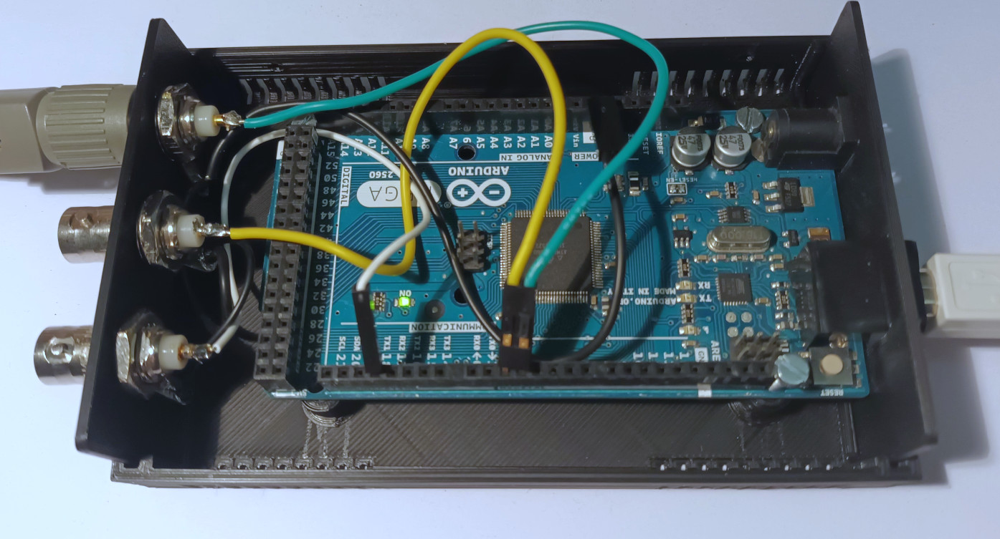
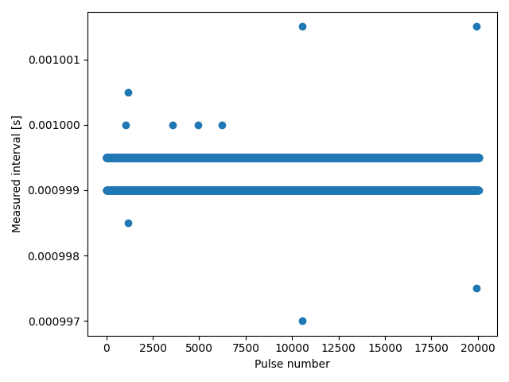

# Arduino Mega Code to record precise TTL pulse timing for several lines in parallel over long duration

The provided code monitors TTL lines and put a 32 bit timestamp each
time a front is detected on one of the lines. The 32 bit timestamps,
provides more than 2000 seconds of monitoring with 0.5μs resolution,
and is provided by the microcontroller internal clock. A one byte flag
identifies the TTL line corresponding to each event.

The code is written for Atmega 2560 (monitoring up to 6 lines in
parallel) and 326P (up to 2 lines) and has been tested on Arduino Mega
2560 and Arduino Nano boards. The Arduino API being bypassed in
several places to solve performance and timing issues, port to other
microcontrollers may require a bit of work.

## Installation

The code comes in two parts: a firmware for the microcontroller unit
(MCU) and a python API handling the custom communication with the
MCU. Both live in the same repository than can be retrieve from github
with:

```
git clone https://github.com/betoule/logic_timer
```

### MCU code

```
sudo apt install gcc-avr avr-libc avrdude make
```
The MCU code can be compiled and uploaded using the usual Arduino
IDE. Alternatively, we provide a makefile to compile and upload using
the Arduino-Makefile tool:

+ Connect the board, compile and upload the firmware with:
```
make upload
```

### Python API

Installation of the python API using pip is obtained as:

```
pip install .
```

## Usage

Connect the TTL and ground lines to the corresponding external
interrupt pins and ground pins on the Arduino board. The
correspondence between line identifiers and board pins is given for
the two implemented boards in the following table:

| Line Id | Flag   | Interrupt 2560 | Arduino Mega pin | Interrupt 326P | Arduino Nano pin |
|---------|--------|----------------|------------------|----------------|------------------|
| 0       | 1 << 0 | INT4           | 2                | INT0           | D2               |
| 1       | 1 << 1 | INT5           | 3                | INT1           | D3               |
| 2       | 1 << 2 | INT3           | 18               |                |                  |
| 3       | 1 << 3 | INT0           | 21               |                |                  |
| 4       | 1 << 4 | INT1           | 20               |                |                  |
| 5       | 1 << 5 | INT2           | 19               |                |                  |

The following picture displays a 3 lines implementation using an
Arduino Mega.


STL files for the box are available in the 3D\_printed\_box
directory. Custom enclosure can easily been obtained with the
[ultimate box maker](https://www.thingiverse.com/thing:1264391).

Assuming that the path to the serial device corresponding to the
arduino is /dev/ttyACM0, the following command will trigger a 20 second
record of the rising edges of pin 2 and 3 and of the falling edge
of pin 18 and store the result to timing.npy: 

```
logic-timer -t /dev/ttyACM0 -d 20 -l 0r 1r 2f -o timing.npy
```

The result is a numpy record array with one entry for each detected
front and two columns *time* and *pinstate*. The timestamp in column
*time* is a 32 bit integer counting since the start of the record with
a resolution of 0.5μs. The 8 bit flag in column *pinstate* indicates
which line triggered the record according to the correspondence table
above. The record ends with a special entry whose *pinstate* value is
255. The corresponding timestamp gives the exact duration of the
monitoring.

As an example, the code below analyses a 20s record with a 1kHz square
wave in input 1. The plot displays the measured interval between
successive pulses. The rms of the measurements is 0.16 μs and peak to
peak deviation is 6 μs (see section Limitations for a discussion on
the timing accuracy).

```python
import numpy as np
import matplotlib.pyplot as plt
record = np.load('timing.npy')
t = record['time'][record['pinstate'] == 2]
t = t * 0.5e-6 # Convert timing in seconds
plt.plot(t[1:] - t[:-1], 'o')
plt.ylabel('Measured interval [s]')
plt.xlabel('Pulse number')
plt.tight_layout()
plt.savefig('doc/interval_accuracy.png')
```



## Limitations

+ Use case: The code is intended to record events occurring at random
  times. As such, it generates 5 bytes of data per detected pulses (4
  bytes for timing and 1 byte for line identification). It can only be
  used for timing events occurring with moderate frequency in
  average. It is not suited to record digital communications on a
  regular clock.

+ Handling of synchronous events: The interrupt handling routine takes
  about 5 μs to complete (82 instructions). Simultaneous events will
  therefore be reported as separated by at least 5 μs and ordered by
  the interrupt priority. This sets the worst case scenario for the
  timing precision. For non conflicting events the timing precision is
  limited by the clock resolution of 500 ns.
  
* Events in close succession: For the same reason, the second of two
  events occurring on the same line at an interval smaller than 5μs
  will be ignored. With some work to rewrite the interrupt handling
  routine in assembler, the dead time could probably be brought down
  to 2μs. If you think it could be useful, feel free to submit an
  issue. For the record, the timestamps is currently attributed 2.1μs
  after the edge detection.

+ Average frequency: The maximal average frequency of events is
  limited by the bandwidth of the serial communication. The data is
  send encapsulated in packets of 8 bytes fed to a 256 bytes buffer
  (32 events). The buffer is emptied as fast as possible through the
  serial link. 1Mbps communication have been found to be reliable for
  the tested boards so that the theoretical maximum for the event
  frequency in a sliding window of 32 events is about 15kevents/s. In
  practice overflowing the buffer will possibly result in crashing the
  microcode beyond recovery, therefore a solid margin should be
  considered so that this cannot occur.

+ Time scale accuracy: Oscillating frequencies of the ceramic
  resonators (CSTCE16M0V53-R0) clocking the Arduino Mega boards are
  only accurate at the ~10⁻³ level. The resulting inaccuracy in the
  clock scale does not matter when the device is solely used to
  provide synchronization between the different lines. However
  comparison to external clocks are likely to be affected by the error
  in the MCU clock calibration and temperature shift. For applications
  requiring external references, the simplest work-around is to add
  the external reference as an additional line. It might be
  interesting to add functionalities to calibrate the MCU clock so
  that timestamps can be accurately converted to seconds for
  application where the time scale matters. Reaching acceptable
  accuracy would however likely require additional hardware to monitor
  the MCU temperature, or replacement of the ceramic oscillator with a
  temp controlled Xtal oscillator (TCXO such as DS3231). Nano boards
  ship with a quartz resonator from which better accuracy might be
  expected. Unfortunately the 326 only features 2 external interrupts.

# How to cite

[](https://zenodo.org/doi/10.5281/zenodo.7130088)

By releasing logic_timer as an open source tool we want to foster open
science and enable everyone to use it in their research free of
charge. If it proves useful and you would like to acknowledge the
author in your publication, you can cite the DOI (see badge above). Do
not hesitate to send an email for support and/or collaboration.
